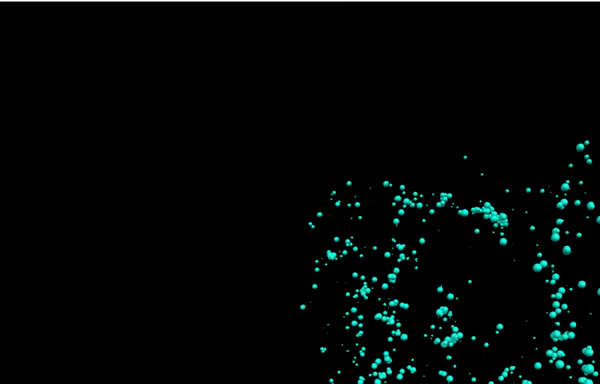

# N-Body Simulation

This is an n-body simulation visualizer using C and Python. It implements [Barnes-Hut Algorithm](https://en.wikipedia.org/wiki/Barnes%E2%80%93Hut_simulation) to simultate an open or globular star cluster.

## Examples

[Globular Cluster](https://en.wikipedia.org/wiki/Globular_cluster)

[Open Cluster](https://en.wikipedia.org/wiki/Open_cluster)

## Real Start Clusters in the Universe

Globular Cluster

Open Cluster

## How to Run

To run the simulation, simply run the .sh files for open or globular clusters.

Syetem requirements: 

[GCC](https://gcc.gnu.org/) (In the .sh files it's gcc-7 but you can change that to your version)

[Python](https://www.python.org/downloads/) (python3 in the .sh file but you can change that too)

[Linux Shell](https://docs.microsoft.com/en-us/windows/wsl/install-win10) or Linux

